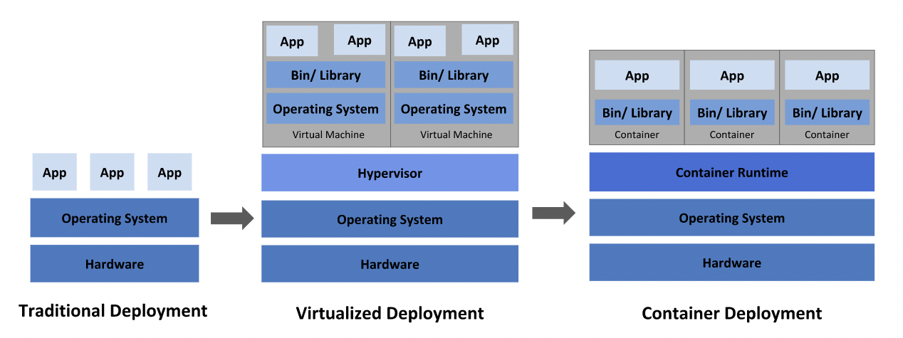

# k8s-practice    

## what is k8s    
* __containerized workload, service__ 를 관리하는 오픈소스 플랫폼이다.     
* 2014년에 google이 시작한 프로젝트다.     
* 

## going back in time     
    

* __traditional deplyment__    
  * 물리적 서버에서 애플리케이션을 실행해야 한다.     
  * 애플리케이션 간 리소스에 대한 경계를 지을 방법이 없어서 특정 애플리케이션이 리소스를 독점 해버리는 문제가 있다.    
  * 각 애플리케이션을 각각 물리서버에 배포한다면 자원에 대한 scaling이 불가하고(미사용 자원이 관리가 안되고), 비용이 많이 든다.           
* __virtual deployment__    
  * 하나의 물리 서버에서 다수의 vm을 실행할 수 있다.
  * vm은 각 애플리케이션의 격리를 보장하고, 따라서 다른 애플리케이션의 정보에 자유롭게 접근하지 못하도록 보안을 제공한다.     
  * 애플리케이션이 쉽게 추가, 수정이 가능하여 scalable하고 비용을 낮출 수 있다.     
  * vm은 __own os__ 를 가지는 실행 컴포넌트이다.     
* __container deployment__    
  * vm과 비슷하지만, 애플리케이션 간 os를 공유하는 __relaxed isolation__ 을 위한 설정을 가진다.     
  * 따라서 lightweight 하다.      
  * vm과 마찬가지로 filesystem, share of cpu, memory, process를 가진다.    
  * 기반 시스템과 decoupled 되어 cloud, os에 대해서 자유롭다.     
  * 다음과 같은 추가적인 이점이 있다.    
    * 더 쉽고 효율적인 creation    
    * image immutability로 인한 신뢰성과 효율성으로 CI/CD 용이       
    * 개발과 인프라의 분리 : 빌드 단계에서 이미 image로서 애플리케이션을 개발한다.     
    * Observability : os-level 뿐 아니라 애플리케이션이나 기타 정보 모니터링이 용이하다.     
    * 개발, 테스트, 프로덕션에서 동일한 환경을 보장한다.       
    * application centric management가 용이하다.     
    * Loosely coupled, distributed, elastic, liberated micro-services: 애플리케이션이 작게 쪼개지고 독립적인 조각이며, 각각 동적으로 배포 및 관리할 수 있다.      
    * resource isolation 을 통해 application으 perfomance가 예측 가능하다.      

## why k8s     
* container 방식의 애플리케이션 운영 시에 __no-downtime__ 을 보장하기 위해 system으로 handling 하는 것은 쉽지 않다.     
* k8s은 framework으로서 위의 문제를 포함해 다양한 것들을 해결해 줄 수 있다.     
* k8s가 제공하는 것들   
  * __service discovery and load balancing__    
    > * DNS name이나 IP adress를 통해 컨테이너를 노출한다.     
    > * 컨테이너에 트래픽이 높으면 트래픽을 load balancing하고 distribute 하여 애플리케이션을 안정적으로 유지한다.     
        >> 💡 load balancing이란?      

  * __storage orchestration__     
    > * local storage나 public cloud 등의 저장 시스템에 자동으로 mount할 수 있게 한다.     

  * __automated rollout and rollback__     
    > * 배포된 container의 원하는 state를 서술 및 제어할 수 있다.     

  * __automated bin packing__     
    > * containerized task를 실행하기 위한 노드 클러스터를 k8s에 제공한다.     
    > * k8s는 설정에 따라 cpu, memory에 대해 효율적으로 container에 맞춘다.     
  
  * __self healing__     
    > * 실패에 대해선 재시작, unhealthy에 대해선 replace, kill을 통해 정상적으로 serving하기 전에는 클라이언트에게 노출하지 않는다.     

  * __secret and configuration management__     
    > * container image를 rebuild할 필요 없이 노출되지 않도록 민감 정보를 저장 및 관리할 수 있다.     

## k8s is not    
* k8s는 hardware level이 아닌 __container level__ 에서 동작하기 때문에 deploy, scailing, load balancing, logging, monitoring, alerting 과 같은 일반적인 기능을 제공한다.      
* 하지만 optional, pluggable하게 solution을 제공하므로써 사용자에게 유연성을 보장한다.       
* 애플리케이션이 container에서 동작한다면, workload의 다양성을 제한하지 않는다.   
* source code를 빌드하거나 배포하지 않는다.     
* application-level의 서비스를 제공하지 않되, k8s 상에서 구동되거나 open service broker와 같은 이식 가능한 매커니즘으로 접근한다.     
* logging, monitoring, alerting과 같은 솔루션을 제공하지 않는다.     
* 단순한 의미의 ochestration system이 아니다. 독립적이고 조합 가능한 프로세스를 제공함으로써 지속적으로 현재 상태를 의도한 상태로 나아가도록 할 뿐이다.      
